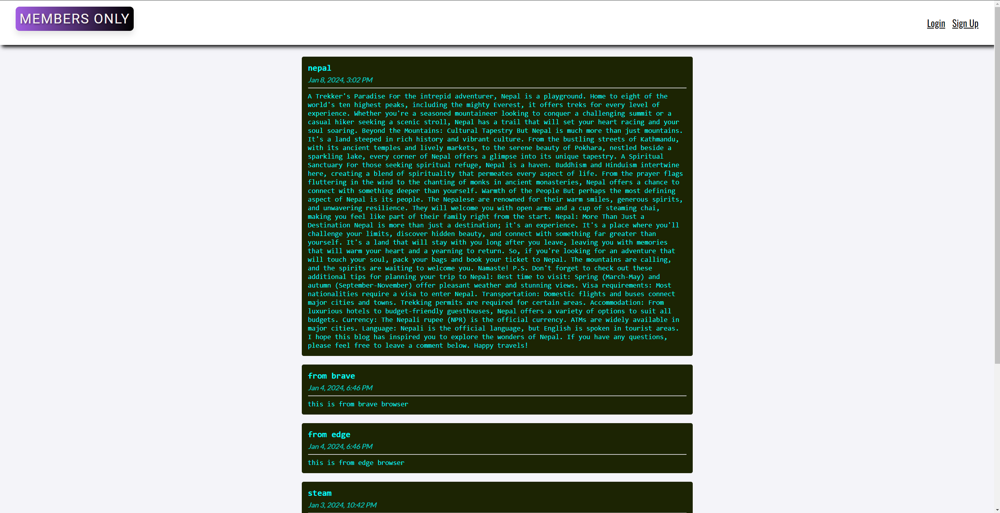
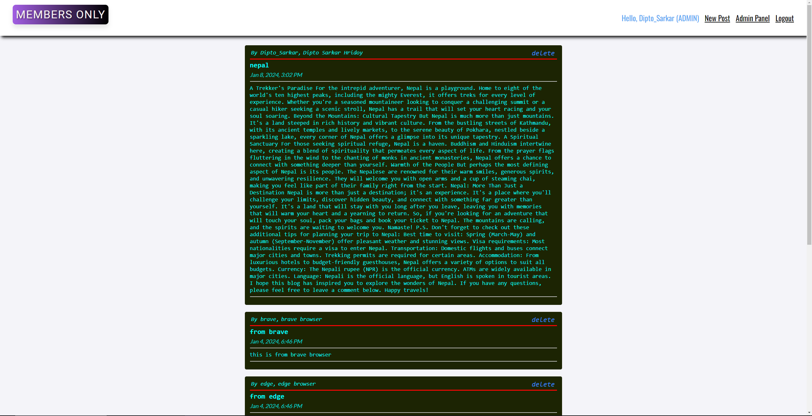

# members_only_nodejs

Welcome to the Members Only Node.js application! This project is built using the Express.js framework and MongoDB for handling user sign-up, login, post storage, and managing access privileges. Live demo on https://members-only-nodejs.onrender.com. If this link takes too long to load, try this one https://members-only-nodejs.adaptable.app/

## Features

- **User Authentication:** PassportJS is used for user authentications. Users can sign up, log in, and securely store their session information. Users password information is hashed and salted using the bcryptjs library. 
  
- **Post Management:** Registered users can create and view posts within the application.

- **VIP and Admin Privileges:** Special privileges are reserved for VIP members and Admin users. VIP members and Admins have access to additional features such as viewing post authors, and Admins can delete posts. Admins can also use admin panel to create secret keys for both VIP and Admin users. 

- **Secret keys to become VIP or Admin users is: 123456**

## Screenshots





## Installation

1. Clone the repository
2. Install dependencies
   ```sh
   npm install
   ```
3. Create a `.env` file in the root directory and add the following environment variables
   ```sh
    MONGODB_URI=your_mongodb_uri
    SESSION_SECRET=your_session_secret
    MEMBERSHIP_CODE=choose_a_secret_code
    ADMIN_CODE=choose_a_secret_code
    ```
4. Start the server
    ```sh
    npm run dev
    ```
5. Open your browser and navigate to `http://localhost:3000`